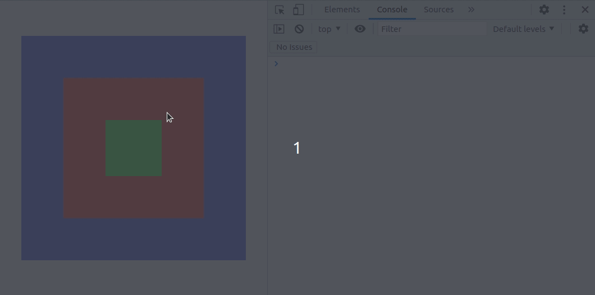
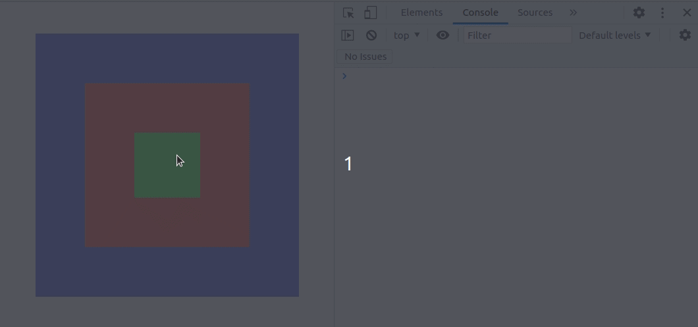
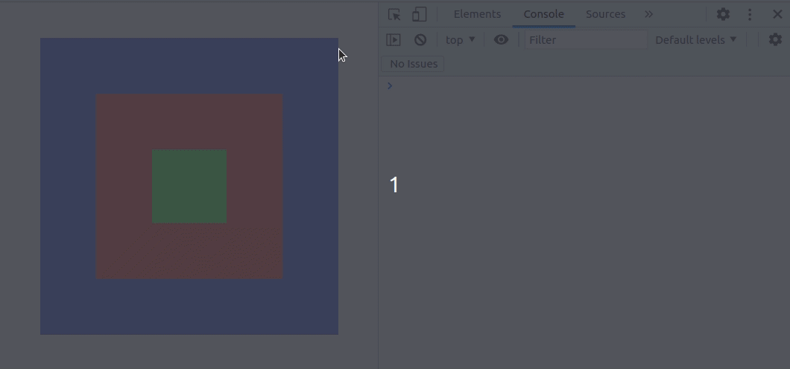

# JavaScript event handling: stopPropagation vs stopImmediatePropagation
In javascript, when any event like a click or mouse-over occurs on a dom element, it goes through the capturing and bubbling phases.  
Consider the following code:  
```html
<!-- eventHandlingExample.html -->
<!DOCTYPE html>
<html lang="en">
  <head>
    <title>Difference Between event.stopPropagation() and event.stopImmediatePropagation()</title>
    <style>
      html,
      body {
        margin: 0;
        padding: 0;
        width: 100%;
        height: 100vh;
        display: flex;
        align-items: center;
        justify-content: center;
      }
      div {
        display: flex;
        align-items: center;
        justify-content: center;
      }
      #grandparent {
        width: 400px;
        height: 400px;
        background-color: rgb(147, 147, 252);
      }
      #parent {
        width: 250px;
        height: 250px;
        background-color: rgb(255, 129, 129);
      }
      #child {
        width: 100px;
        height: 100px;
        background-color: rgb(137, 255, 137);
      }
    </style>
  </head>

  <body>
    <div id="grandparent">
      <div id="parent">
        <div id="child"></div>
      </div>
    </div>

    <script>
      const gp = document.getElementById("grandparent");
      const p = document.getElementById("parent");
      const c = document.getElementById("child");

      // Capturing
      gp.addEventListener("click", (e) => { console.log("Capture: Grandparent clicked!") }, { capture: true } );
      p.addEventListener( "click", (e) => { console.log("Capture: Parent clicked!") }, { capture: true } );
      c.addEventListener( "click", (e) => { console.log("Capture: Child clicked!")  }, { capture: true } );

      // Bubbling
      gp.addEventListener("click", (e) => { console.log("Bubble: Grandparent clicked!") });
      p.addEventListener( "click", (e) => { console.log("Bubble: Parent clicked!") });
      // p.addEventListener( "click", (e) => { e.stopPropagation(); console.log("Bubble: Parent clicked!"); });
      // p.addEventListener( "click", (e) => { e.stopImmediatePropagation(); console.log("Bubble: Parent clicked!"); });
      c.addEventListener( "click", (e) => { console.log("Bubble: Child clicked!") });

      // Other Events on Parent
      p.addEventListener("click",  (e) => { console.log("Alpha Bubble: Parent clicked!") });
      p.addEventListener("click",  (e) => { console.log("Beta Bubble: Parent clicked!") });
    </script>
  </body>
</html>
```
and its output when the `<div id="child"></div>` element is clicked.  



### Capture Phase
During the capturing phase the event is triggered from the outermost dom element, going inwards till it reaches the element it actually occurred on. In the example, if we have click listeners attached to all three dom elements, the grandparent, parent and child divs. When a click is registered on the child div, the capturing phase starts triggering the listeners of the grandparent and then the parent and then the child. So, we see the messages in the console in that order. To listen to events in the capture phase, send the third argument to `addEventListener` as `{ capture: true }`.  

### Bubble Phase
During the bubbling phase the event is triggered from the actual dom element the event occurred on, going outwards. So in the example, if we have click listeners attached to all three dom elements, the grandparent, parent and child divs. When a click is registered on the child div, the capturing phase starts triggering the listeners of the grandparent and then the parent and then the child. So, we see the messages in the console in that order.

> **Note:** WebDevSimplified has a great [video](https://www.youtube.com/watch?v=XF1_MlZ5l6M) on this if you want to learn more.

### stopPropagation vs stopImmediatePropagation
Using [stopPropagation](https://developer.mozilla.org/en-US/docs/Web/API/Event/stopPropagation) stops events form being bubbled / captured by any parent or child element of the current element on which the event occurred but does not prevent any other event-listeners for the same event from being triggered if they are attached to the current element.
Let's change the parent's event listener to:
```js
p.addEventListener( "click", (e) => { e.stopPropagation(); console.log("Bubble: Parent clicked!"); });
```
Output when child is clicked:


If we just replace the `e.stopPropagation()` with `e.stopImmediatePropagation()` we get the following output.
